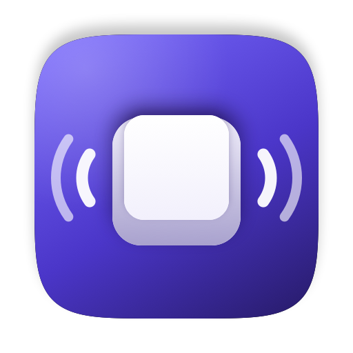

<div align="center">



# KbSound

**Mechanical keyboard sounds for macOS, right from the menu bar.**


### [⬇︎ Download the latest DMG](https://github.com/zhanjianbirui/Kbsound/releases/latest)

[简体中文](README.zh-CN.md)

</div>

---

| | |
|---|---|
| 🎹 | **21 built-in sound packs** — Cherry MX, Topre, NovelKeys Cream, Holy Pandas and more, switchable from the menu bar |
| 🔊 | **Loudness-normalized** — every pack lands at the same perceived volume, so switching never jumps |
| ⚡️ | **Low latency** — lead-in trimming and a small IO buffer keep key-to-sound tight |
| 📦 | **Imports Mechvibes packs** — drop in any community pack folder, no transcoding |
| 🌏 | **English and 简体中文**, following your system language |
| 🔒 | **No network access, no telemetry** — ~7 MB of audio, negligible CPU |

## Install

**1 · Download and drag in.** Open the [latest DMG](https://github.com/zhanjianbirui/Kbsound/releases/latest)
and drag **KbSound** onto the Applications folder.

**2 · Clear the quarantine flag.** The app is ad-hoc signed — there is no Apple developer
certificate — so macOS blocks anything downloaded from the internet. Run this once:

```sh
xattr -dr com.apple.quarantine /Applications/KbSound.app
```

<details>
<summary>Rather not use Terminal?</summary>

Double-click KbSound, let macOS refuse it, then open **System Settings › Privacy &
Security**, scroll to the bottom and click **Open Anyway**. On some macOS versions this
path is unavailable for unsigned apps, in which case the `xattr` command above is the
only way.
</details>

**3 · Grant Accessibility permission.** Launch KbSound. There is no Dock icon — look at
the right side of the menu bar, where a crossed-out speaker appears. Click it, then the
yellow banner, and tick KbSound in **System Settings › Privacy & Security ›
Accessibility**. No restart needed: the icon turns into a keyboard within about two
seconds and typing starts making sound.

> Reading your keystrokes is what Accessibility permission is for — it is how the app
> knows a key was pressed. Nothing is stored or sent anywhere; [`KeyEventTap.swift`](Sources/KbSoundCore/KeyEventTap.swift)
> is 100 lines and the key code goes straight into a dictionary lookup.

<details>
<summary>Build from source instead</summary>

```sh
./scripts/dmg.sh      # builds build/KbSound-1.0.dmg
# or just the .app:
./scripts/bundle.sh && cp -R build/KbSound.app /Applications/
```

A locally built app needs no `xattr` step. But ad-hoc signatures identify the binary by
its code hash, so **every rebuild invalidates the existing Accessibility grant** — remove
the stale entry in System Settings and tick the new one.

It must run as a packaged `.app`: Accessibility permission is granted per bundle
identifier, so under `swift run` the grant would go to your terminal, and Login Item
support is unavailable.
</details>

## Usage

Click the keyboard icon in the menu bar:

| Control | What it does |
|---|---|
| **Keyboard sounds** | Main switch. The icon turns into a crossed-out speaker when it is off or unauthorized. |
| **Volume** | Takes effect immediately. |
| **Sound packs** | 21 built in; click one to switch. |
| **Import sound pack…** | Imports an external pack; see below. |
| **Launch at login** | Follows the system's login item state. |

## Loudness normalization

Community packs are recorded at wildly different levels — across the 21 bundled
packs the onset RMS spans **23.7 dB** (`topre-silent` at −16.6 dBFS, `lofi` at
−40.3 dBFS). At a fixed volume setting, switching packs used to mean a jarring
jump in loudness.

Each pack is measured on load and given a single gain that aligns it to a common
target, bringing the spread down to **2.9 dB**. The target (−34 dBFS) is chosen so
the median gain across the 21 packs is ~0 dB: normalization *aligns* packs without
making anything louder, so a given slider position sounds the same as it always did.
Four deliberate choices (`Sources/KbSoundCore/LoudnessNormalizer.swift`):

1. **One gain per pack, not per file.** A spacebar recorded louder than the letter
   keys is the pack author's intent; per-file normalization would flatten it.
2. **RMS over a 120 ms window after onset**, not over the whole file. Whole-file RMS
   is skewed by tail length and trailing silence, while the perceived loudness of a
   keystroke comes almost entirely from the onset.
3. **A target that leaves overall volume alone.** The first attempt aimed at the
   median *recorded* level (−28 dBFS) and made everything 5.25 dB louder, since most
   packs sit well below their own median. The target is now pinned so the default
   pack comes out at −0.75 dB.
4. **Soft limiting instead of backing the gain off.** A few packs (`cream-travel`,
   `mx-brown-pbt`) already peak near full scale but sit low in RMS; leaving peak
   headroom would mean they could never be brought up. A few dB of tanh soft limiting
   on a transient that short is inaudible.

Files are also weighted by how many keys reference them — what a pack *sounds like*
while typing is set by the default sound covering most keys, not by the one mapped
only to the spacebar.

## Sound packs

21 packs ship with the app. Sources and licensing are in [`THIRD-PARTY.md`](THIRD-PARTY.md).

### Importing an existing pack

Click **Import sound pack…** and pick the pack's **folder**. Three formats are
auto-detected:

| Format | Detected by |
|---|---|
| KbSound native | a `manifest.json` in the directory |
| Mechvibes `multi` | a `config.json`, one file per sound |
| Mechvibes `single` | a `config.json` and a single audio sprite, sliced by timing |

Virtually every Mechvibes pack floating around online imports directly. macOS decodes
wav / mp3 / m4a / flac / Ogg Vorbis / Opus natively, so no transcoding is needed.

Imported packs land in `~/Library/Application Support/KbSound/Packs/<pack-id>/`.
A matching id shadows a built-in pack; re-importing replaces rather than stacks.

### Writing one by hand

Drop a directory with a valid `manifest.json` into the same location. The schema is
documented in [`docs/sound-pack-format.md`](docs/sound-pack-format.md).

To batch-convert Mechvibes packs from the command line:

```sh
python3 scripts/import-mechvibes.py <mechvibes src/audio dir> <output dir>
```

## About latency

Key-to-sound latency comes from three places; the first two are handled in code:

1. **Lead-in in the audio file** — by far the largest. Several packs recorded the full
   key travel, so the actual transient starts very late (195 ms in the worst pack
   measured). Trimmed on load by relative peak, keeping 2 ms of pre-roll so the
   transient is not clipped flat.
2. **Output device IO buffer** — macOS defaults to 512 frames (10.67 ms at 48 kHz),
   lowered to 128 before the engine starts. This is a device-wide setting; if other
   audio apps start glitching, raise `OutputDeviceLatency.preferredFrames` to 256.
3. **The pack's own recording style** — `NovelKeys Cream`, `Turquoise` and
   `NK Cream · Full Travel` have the fastest attack. Pick those if responsiveness
   matters most to you.

To measure key event delivery on your own machine:

```sh
swift run LatencyProbe
```

## Development

```sh
swift build && swift test      # build + unit tests (113)
swift run TapProbe             # verify CGEventTap works
swift run LatencyProbe         # measure key event delivery latency
swift run KbSound              # dev run (from the repo root; no Login Item support)
```

Architecture: `KbSoundCore` holds everything testable — event tap, audio engine,
pack loading, normalization, settings — and the `KbSound` executable is a thin
AppKit/SwiftUI shell around it. Sound packs are decoded to resident PCM buffers on
switch, so the key callback does nothing but a dictionary lookup; no file I/O ever
happens on the hot path.

UI strings live in `Sources/KbSoundCore/Resources/<locale>.lproj/Localizable.strings`
and are resolved through the `loc(_:)` helper in `Localization.swift`. To add a language,
add an `.lproj` directory and list the locale in `CFBundleLocalizations` in
`scripts/bundle.sh`.

The app icon is drawn in code rather than stored as a binary blob — edit
`scripts/make-icon.swift` and run `swift scripts/make-icon.swift` to re-render
`Resources/AppIcon.icns`.

## License

Code is released under the MIT License (see [`LICENSE`](LICENSE)).

Bundled audio is **not** covered by that license. It comes from
[klinkmac](https://github.com/rockykusuma/klinkmac),
[mechvibes](https://github.com/hainguyents13/mechvibes) and
[kbsim](https://github.com/tplai/kbsim); provenance and the limits of what is known
about each pack's licensing are documented in [`THIRD-PARTY.md`](THIRD-PARTY.md).
If you own one of these recordings and want it removed, open an issue.
